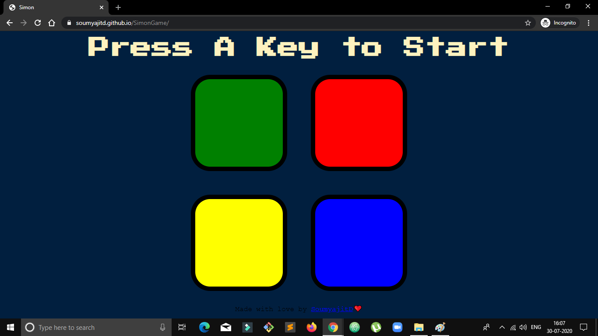
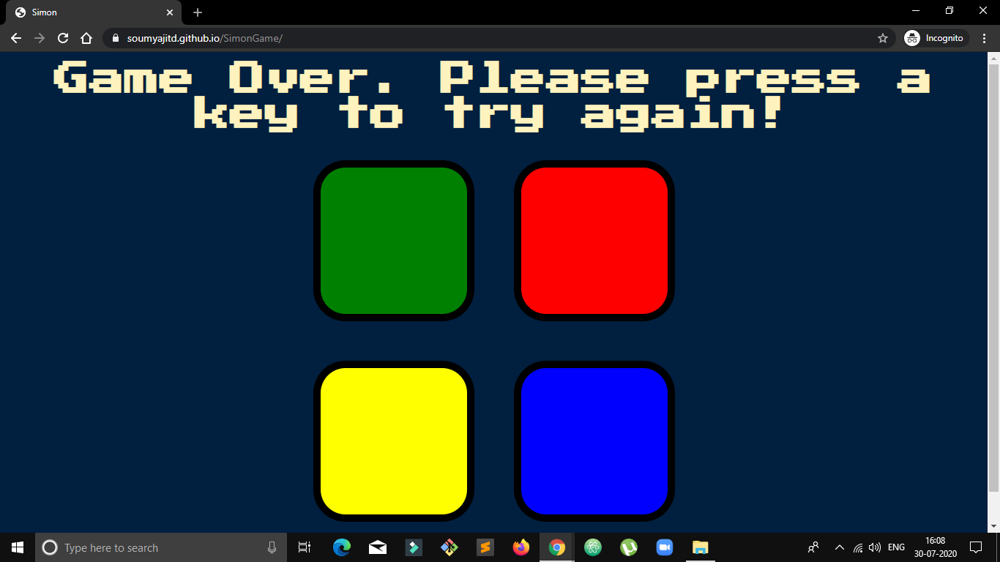

# SimonGame
<H2>A simple web based version of the popular game Simon.</H2>  
Read More about it: https://en.wikipedia.org/wiki/Simon_(game) 

<H3>How to play?</H3> 
<ul>
<li>Open the game and press a key to start the game.</li>
<li>A certain block will be highlighted and you have to remember the piece and select the one that was hightlighted.</li>
<li>On succesful clicks the level will increase and the pattern will become more and more complex.</li>
<li>Complete as many levels as you can.</li>
<li>After any wrong input, press any key again to continue.</li>

 

 

